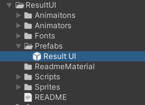
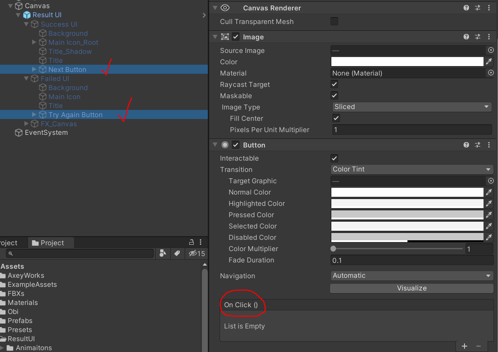
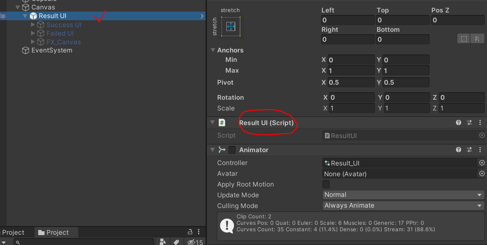

# Result UI

## 額外套件

用 Package Manager 或是直接在 GitHub 將以下套件導入到專案中

- https://github.com/mob-sakai/ParticleEffectForUGUI.git

另外文字是使用 TextMesh Pro 套件

## 使用方式

1. 將 Prefabs/ResultUI.prefab 拉到場景的 Canvas 下

1. 設定成功跟失敗 UI 裡的按鈕要執行的動作，像是重讀關卡、讀下一關等

1. 透過 `ResultUI` 來控制要顯示哪個畫面
 \
  範例程式：
  
    ```csharp
    public class MyManager : MonoBehaviour
    {
        [SerializedField]
        private ResultUI _resultUI;

        private void PlayerWin()
        {
            _resultUI.ShowSuccessUI();
        }

        private void PlayerLose()
        {
            // 裡面可以指定要不要延遲出現的秒數
            _resultUI.ShowFailedUI(1);
        }
    }
    ```
